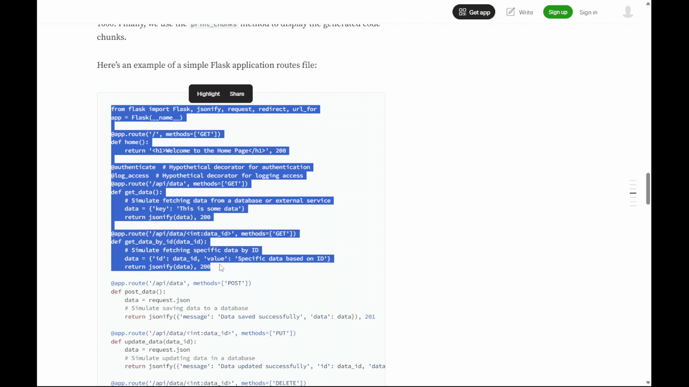

# ClipTyper

A small Windows tray app that **types** your clipboard as real keystrokes instead of pasting it.

Useful anywhere paste is blocked or broken: VM consoles, iLO/iDRAC/IPMI web consoles, some RDP or VDI sessions, and editors that disable paste.



**[Download ClipTyper.exe](https://github.com/PowerisTsutsun/ClipTyper/releases/latest/download/ClipTyper.exe)** (Windows, no install needed)

The exe isn't code-signed yet, so you may see two warnings:

- **Edge** says "ClipTyper.exe isn't commonly downloaded." Click **⋯** next to the download, then **Keep**, then **Show more** → **Keep anyway**.
- **Windows SmartScreen** warns on first launch. Click **More info**, then **Run anyway**.

To confirm your download is the official build, run `Get-FileHash ClipTyper.exe` in PowerShell and compare the result with the SHA-256 in the [release notes](https://github.com/PowerisTsutsun/ClipTyper/releases/latest). You can also [build it yourself](#building).

## Usage

1. Run `ClipTyper.exe`. A keyboard icon appears in the system tray, and the Settings window opens on first launch.
2. Copy text as usual.
3. Click where you want it typed and press **Ctrl+Shift+V** (you can change this).
4. Press **Esc** to stop typing early.

The tray tooltip shows progress while it types.

## Settings

Double-click the tray icon, or run `ClipTyper.exe` again, to open Settings.

| Setting | What it does |
| --- | --- |
| Shortcut | Click the box and press any Ctrl or Alt combination. |
| Typing mode | **Exact** types the text as copied. **Code editor** works with IDE auto-indent and auto-closing braces. |
| Delay between keys | 0 to 200 ms. Raise it if a slow or remote window drops characters. |
| Wait before typing | Pause after the shortcut before typing starts. |
| New lines | Send Enter, or Shift+Enter for chat apps that send a message on Enter. |
| Tabs | Press Tab, or convert tabs to a chosen number of spaces. |
| Input method | **Real key presses** work in consoles and RDP. **Unicode** sends exact symbols, accents and emoji. |
| Remove spaces at the end of lines | Drops trailing whitespace. |
| Start with Windows | Adds ClipTyper to your user's startup programs. |

Right-click the tray icon to switch modes quickly, pause the shortcut, or exit.

Settings are stored in `%APPDATA%\ClipTyper\settings.ini`.

## Code editor mode

Code editors auto-indent new lines and auto-close braces. Typing code key by key into them normally produces a "staircase" of indentation and extra `}` at the end. In Code editor mode, ClipTyper:

- Skips the leading whitespace on each line, so the editor's own indentation is used.
- Types a line-ending `{` as `{}`, steps between them, and presses Enter, so the editor places `}` on its own line. When the copied code reaches that `}`, it moves onto it instead of typing another one.

Use Exact mode for terminals and VM consoles, since Code editor mode uses arrow keys to move around.

Known limitations:

- Empty blocks may end up with a blank line inside.
- Javadoc-style `/** ... */` comments may get doubled `*`, since editors add their own.
- If an autocomplete popup is open when Enter is pressed, the editor may accept the suggestion. A longer key delay helps.

## Building

No SDK or Visual Studio needed. Windows ships with the .NET Framework 4 C# compiler. Run:

```bat
build.bat
```

This produces `ClipTyper.exe` in the repo folder.

## Project layout

| File | Purpose |
| --- | --- |
| `src/App.cs` | Entry point, tray icon and menu, global shortcut |
| `src/SettingsForm.cs` | Settings window |
| `src/Settings.cs` | Settings model, load/save, start with Windows |
| `src/Planner.cs` | Turns clipboard text into keystrokes for each mode |
| `src/Typer.cs` | Sends the keystrokes |
| `src/Native.cs` | Win32 calls for hotkeys and keyboard input |

## License

[MIT](LICENSE)
